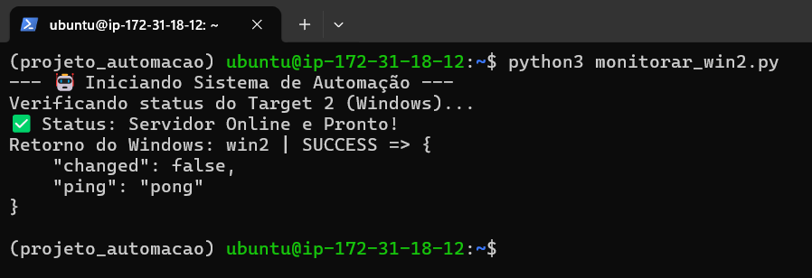

## 🛠️ Arquitetura do Projeto

A intenção desse projeto é simular um ambiente real de gerenciamento de infraestrutura na **AWS**, utilizando uma abordagem de "Nó de Controle" para gerenciar máquinas Windows de forma remota.

### Componentes da Infraestrutura:

1.  **Control Node (Ubuntu 24.04 LTS):**
    * **Papel:** Servidor central de orquestração localizado na AWS.
    * **Stack:** Python3 e Ansible.
    * **Função:** Executa a lógica de automação e dispara comandos para os alvos.

2.  **Target Nodes (Windows Server 2022):**
    * **Papel:** Servidores gerenciados (Managed Nodes).
    * **Protocolo:** WinRM (Windows Remote Management) configurado para aceitar conexões criptografadas.
    * **Segurança:** Configuração de Security Groups na AWS permitindo tráfego apenas do IP privado do Nó de Controle.

3.  **Fluxo de Comunicação:**
    * O usuário executa o script Python no **Control Node**.
    * O Python utiliza a biblioteca `subprocess` para acionar o **Ansible**.
    * O Ansible consulta o arquivo `hosts.ini` para obter as credenciais e endereços IP dos servidores alvo.
    * A conexão é estabelecida via **WinRM**, executando o módulo `win_ping` para validar o estado do servidor.

## 🔒 Segurança

Um pilar central deste projeto foi a proteção de dados sensíveis e a higiene do repositório:

* **Gestão de Credenciais:** O arquivo de inventário real (`hosts.ini`) contendo IPs e senhas foi incluído no `.gitignore` para evitar vazamentos de dados sensíveis.
* **Template de Configuração:** Disponibilizei um arquivo `hosts.ini.example` apenas para contextualizar e estruturar o projeto de forma mais fiel, mas com dados fictíficos.
* **Higiene do Histórico:** Foi realizado um reset de histórico (Git Reset) para garantir que nenhuma versão anterior de logs ou imagens contivesse IPs públicos das instâncias usadas.
* **Princípio do Menor Privilégio:** A automação foi configurada para utilizar autenticação via WinRM, e comunicações internas dentro da rede privada da AWS.

## 🚀 Demonstração de Sucesso

Abaixo, a evidência da execução do script Python orquestrando o Ansible para validar a conexão com o servidor Windows na AWS:

## 💭 Futuras Implementações

Este projeto é um laboratório para experimentos em Cloud e Automação. O objetivo é evoluir a complexidade do script para simular cenários reais de administração de sistemas à medida que eu venha desenvolvendo meu aprendizado na área.

1. **Escalabilidade da Infraestrutura**:
   - Expandir o inventário para gerenciar simultaneamente as outras instâncias AWS já provisionadas, testando a execução de tarefas via Ansible.

2. **Monitoramento Ativo de Performance**:
   - Implementar a coleta de métricas em tempo real (CPU, Memória RAM e Disco) utilizando o módulo `win_powershell`.

3. **Tratamento de Dados com Python**:
   - Desenvolver o tratamento de dados em Python para manipular os retornos JSON do Ansible, e gerar relatórios de saúde (Health Checks) e alertas automáticos dos alvos.